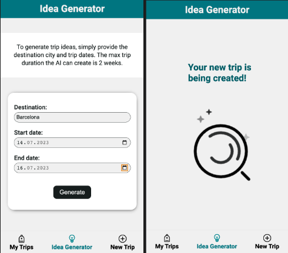
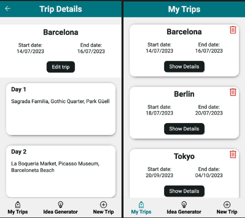

## journAI - AI generated Travel Planner

journAI is your virtual assistant for your next vacation! Planning your first trip to a new city but clueless about what to do? Let journAI generate daily activity suggestions for your entire journey. Explore popular attractions, customize the recommendations, and you're all set for an amazing adventure!

### Create trip with AI

### Display of created trip

## Demo

Check out the deployed version of [`journAI`](https://journai-travel-planner.vercel.app/).

**This project is optimized for mobile screen.** Make sure to switch to mobile view.

## Tech Stack

- React
- Next.js
- Styled Components
- Git
- npm
- Jest
- React Testing Library

## How to setup?

- Clone this repository
- Install all dependencies: `npm install`
- Create : [openAI API account]([https://platform.openai.com/])
- Create `.env.local` file and insert your OPENAI_API_KEY
- Run app in dev mode: `npm run dev`
- Have fun at: [http://localhost:3000](http://localhost:3000)
- Run test via: `npm run test`
